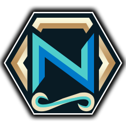

# Naowh Forever

**Naowh's companion addon for World of Warcraft Forever**

Boss reminders, your BiS list, dungeon quests, professions, gear swaps
and a lot of quality of life, all in one window.

[Install](#install) &nbsp;|&nbsp; [What's inside](#whats-inside) &nbsp;|&nbsp; [Commands](#commands) &nbsp;|&nbsp; [Changelog](CHANGELOG.md) &nbsp;|&nbsp; [Contributing](.github/CONTRIBUTING.md)

---

## What's inside

| Module | What it does |
| --- | --- |
| **Smart Reminders** | Tells you what to press when a boss ability is about to land, for dungeon and raid bosses, with cooldown presets for your spec. |
| **BiS List** | Your best-in-slot list, marked on tooltips and called out when it drops. |
| **Dungeon Quests** | Every dungeon quest on Forever, and a tracker for the dungeon you are in. |
| **Professions** | Recipes, reagents and crafting in one window, including the recipes you have not learned yet. |
| **Gear & Trinkets** | Swap equipment sets from a bar, or automatically while you ride or rest. |
| **Blessings** | Paladin blessings by class and player, shared with your group's paladins. |
| **Macros** | Class, consumable and focus macros, written and kept up to date for you. |
| **Buffs & Reminders** | Buff, consumable and campfire reminders, a low health warning and debuff sounds. |
| **Threat Meter** | Threat on your target for the whole group, and a warning before you pull. |
| **Swing Timer** | Your swings from the game's own timer, with marks for timing around them. |
| **Top Bar** | Friends, guild, the clock and your addon buttons across the top of the screen. |
| **Quality of Life** | Questing, loot and bag space, alerts, casting, tooltips, trainer ranks, flight and camp, mail and more. |

> [!TIP]
> Every module starts **off**. Turn on only what you want; anything you leave off costs
> nothing, not even a registered event.

Settings live in **Profiles**, so you can switch between them, copy them to another
character or share them with a friend.

## Install

1. Download the newest `NaowhForever-<version>.zip` from
   [Releases](https://github.com/nwh-gaming-ab/NaowhForever/releases).
2. Extract it into your Forever `Interface\AddOns` folder, so that you end up with
   `Interface\AddOns\NaowhForever\NaowhForever.toc`.
3. Log in, or type `/reload` if you are already in game, then open it with `/nf`.

## Commands

| Command | Opens |
| --- | --- |
| `/nf` | The main window (also `/naowh`, `/nao` and `/nsr`) |
| `/nfbis` | Your BiS list |
| `/nfdq` | Dungeon Quests |
| `/nfgear` | Gear Sets |
| `/nfbless` | Blessings |
| `/nfthreat` | Threat Meter |
| `/nf quiz` | A WoW quiz for flights and campfires |
| `/copy` | The text under your mouse, ready to copy (turn on Global Copy in QoL > Tools) |

You can also open the window from the addon compartment next to the minimap.

## Contributing

Bug fixes and ideas are welcome. Read the [contributing guide](.github/CONTRIBUTING.md)
before you start: it has the rules every change is reviewed against, how to set up the
checks, and how commits and pull requests are named. For anything bigger than a fix,
message Glyalith on [Discord](https://discord.gg/naowh) first.

## Releasing a new version

For maintainers. A release is one click:

1. Check that everything for the release is merged into `main`, and that `## Unreleased` in
   [CHANGELOG.md](CHANGELOG.md) says what changed for players.
2. Open **Actions > Release > Run workflow** and keep the branch on `main`.
3. Pick the **Bump** and click **Run workflow**:

   | Bump | From `0.5.16-beta` |
   | --- | --- |
   | patch (default) | `0.5.17-beta` |
   | minor | `0.6.0-beta` |
   | major | `1.0.0-beta` |

   Untick **Beta** for a full release: major without Beta gives `1.0.0`. Before 1.0.0 every
   release is a pre-release, so the workflow refuses to run with Beta unticked. **Version**
   takes an exact version instead, for anything the bumps can't express.

The workflow then:

- renames `## Unreleased` to the version, sets the TOC `## Version` and `ns.CODE_BUILD`,
  and pushes that as `chore(release): <version>` to `main`;
- tags the commit and builds the zip;
- publishes the GitHub release with the player notes and every commit since the last
  tag, uploads to CurseForge and Wago, and posts the notes to Discord;
- puts an empty `## Unreleased` back at the top of the changelog on `main`, ready for the
  next pull request.

It stops before changing anything if `## Unreleased` is empty or not the newest section,
the tag already exists, or the version is not like `0.5.17-beta`. Pushing a tag by hand
still releases as before.

## License

Copyright 2026 the Naowh Forever authors, all rights reserved. The bundled libraries keep
their own licenses, listed in [LICENSE.md](LICENSE.md).
